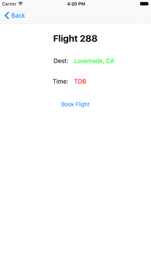

# Data Store iOS
[DataStore](http://cocoadocs.org/docsets/DataStore/0.1.3/Classes/DataStore.html) is the [Eloquent](https://laravel.com/docs/5.2/eloquent) based ORM (for iOS) that also provides a beautiful, simple ActiveRecord implementation for working with your data storage. Each database table has a corresponding [Model](http://cocoadocs.org/docsets/DataStore/0.1.3/Classes/Model.html) which is used to interact with a table by the same name. The Model class allows us to insert new records into the table, query for data in our table, as well as update (and delete from) the table.

More can be found on the Eloquent Model here:
- https://laravel.com/docs/5.2/eloquent#inserting-and-updating-models
- https://laravel.com/api/5.2/Illuminate/Database/Eloquent/Model.html

## Setup

### Installation

DataStore is available through [CocoaPods](http://cocoapods.org). To install
it, simply add the following line to your Podfile:

```ruby
pod "DataStore"
```

### Defining Models

You can update any class to implement [Model](http://cocoadocs.org/docsets/DataStore/0.1.3/Classes/Model.html) in Objective-C:

```
@interface Flight : Model
@property (strong, nonatomic) NSString *name;
@property (strong, nonatomic) NSString *destination;
@end

@implementation Flight
@end
```

Alternatively [Model](http://cocoadocs.org/docsets/DataStore/0.1.3/Classes/Model.html) subclasses can be defined in Swift as well:
```    
class Flight : Model {
    var name: String?
    var destination: String?
}
```

### Basic Inserts / Updates
To create a new record in the database, simply create a new instance of your [Model](http://cocoadocs.org/docsets/DataStore/0.1.3/Classes/Model.html) subclass, set the attributes on that model, and then call the [save](http://cocoadocs.org/docsets/DataStore/0.1.3/Classes/Model.html#//api/name/save) method on your model instance.

```
- (IBAction)bookFlight {

    Flight *flight = [[Flight alloc] init];
    flight.name = self.flightNumberLabel.text;
    flight.destination = self.flightDestinationLabel.text;

    [flight save];

    [self.navigationController popViewControllerAnimated:YES];
}
```
In the example above, we simply assign to the name and destination attributes of the Flight model instance. When we call the save method, a record will be inserted into the database. Alternatively, if you make another change to the Model instance and save it again, it will update the database record instead.

### Retrieving Multiple Records
Now that we have seen how to use the [save](http://cocoadocs.org/docsets/DataStore/0.1.3/Classes/Model.html#//api/name/save) method on a [Model](http://cocoadocs.org/docsets/DataStore/0.1.3/Classes/Model.html), we are ready to start retrieving data from our database.

Next we will query the database table associated with the model for all records, with the [all](http://cocoadocs.org/docsets/DataStore/0.1.3/Classes/Model.html#//api/name/all) function:
```
- (void)viewDidAppear:(BOOL)animated {
    [super viewDidAppear:animated];

    NSArray * all = [Flight all];
    for (Flight* flight in all) {
        ...
    }
}
```
In this example, we simply assign the NSArray from the [all](http://cocoadocs.org/docsets/DataStore/0.1.3/Classes/Model.html#//api/name/all) function of the Flight class. As you can see, with a single function call we can get all the records of a specific database table.

Alternatively, if you want to query a subset you will have to use the [advanced branch]() of the DataStore Framework to get access to the [where]() and [orWhere]() query builder functions and the [get]() function to execute the queries.


### Retrieving A Single Record
In addition to retrieving all of the records for a given table, you can also retrieve a single record. Instead of returning a collection of records like with the [all](http://cocoadocs.org/docsets/DataStore/0.1.3/Classes/Model.html#//api/name/all) function, the [find](http://cocoadocs.org/docsets/DataStore/0.1.3/Classes/Model.html#//api/name/find) function returns a single [Model](http://cocoadocs.org/docsets/DataStore/0.1.3/Classes/Model.html) instance:
```
- (void)viewDidAppear:(BOOL)animated {
    [super viewDidAppear:animated];

    Flight *flight = (Flight *)[Flight find:1];
    self.flightLabel.text = flight.name;
}
```
Once you have a [Model](http://cocoadocs.org/docsets/DataStore/0.1.3/Classes/Model.html) instance, you can use the column values of the table by accessing the corresponding property. For example, above we get a Flight instance from the [find](http://cocoadocs.org/docsets/DataStore/0.1.3/Classes/Model.html#//api/name/find) function, and begin accessing the name column from the Flight database table.


### Retrieving Aggregates
You also have access to the [count](http://cocoadocs.org/docsets/DataStore/0.1.3/Classes/Model.html#//api/name/count) function provided by the Model class. This function returns the appropriate scalar value instead of a full model instance (or collection of instances):
```
- (void)viewDidAppear:(BOOL)animated {
    [super viewDidAppear:animated];

    NSInteger count = [Flight count];
    self.flightCountLabel.text = [NSString stringWithFormat:@"%d Flight(s) Booked", count];
}
```
In this example, we simply assign the count variable from the Flight model class' [count](http://cocoadocs.org/docsets/DataStore/0.1.3/Classes/Model.html#//api/name/count) function and report it to the UI component.


### Deleting Records
To delete a record, call the [remove](http://cocoadocs.org/docsets/DataStore/0.1.3/Classes/Model.html#//api/name/remove) method on a model instance:
```
- (IBAction)cancelFlight {

    Flight *flight = (Flight *)[Flight find:1];
    [flight remove];
}
```

Alternatively, to delete all records from a database table, call the [truncate](http://cocoadocs.org/docsets/DataStore/0.1.3/Classes/Model.html#//api/name/truncate) function:
```
- (IBAction)cancelAllFlights {

    [Flight truncate];
}
```

## Example Project
The Example Project has 3 screens that display basic [Model](http://cocoadocs.org/docsets/DataStore/0.1.3/Classes/Model.html) CRUD operations, using the Flight class as an example.

  

 The CRUD operations are completed using the [count](http://cocoadocs.org/docsets/DataStore/0.1.3/Classes/Model.html#//api/name/count), [truncate](http://cocoadocs.org/docsets/DataStore/0.1.3/Classes/Model.html#//api/name/truncate), [save](http://cocoadocs.org/docsets/DataStore/0.1.3/Classes/Model.html#//api/name/save) and [all](http://cocoadocs.org/docsets/DataStore/0.1.3/Classes/Model.html#//api/name/all) functions. 

If you are looking for more than those basic operations, the [advanced branch]() contains a more in depth [Laravel Eloquent](https://laravel.com/docs/5.2/eloquent) implementation and Example project (still under development).

To run the example project, clone the repo, and run `pod install` from the Example directory first.
```
git clone https://github.com/the-mac/data-store-ios.git
cd Example
pod install
```
## Requirements
This pod uses the [FMDB](http://cocoadocs.org/docsets/FMDB/2.6.2/) Framework, and is already included in the example Podfile. For your own project (and Podfile), our DataStore reference could look as follows:
```
platform :ios, '8.0'
target 'MyApp'
pod 'DataStore'
```

## Author: Christopher Miller
Android/iOS Project Manager

- [Github Profile](https://github.com/cdm2012)
- [Linked-In Profile](https://www.linkedin.com/in/christophermiller64)

## Contributing
See [CONTRIBUTING.md]() for more on what is required to contribute.

### Current Contributors

[Your Name Here](#)

## License

DataStore is available under the MIT license. See the LICENSE file for more info.
